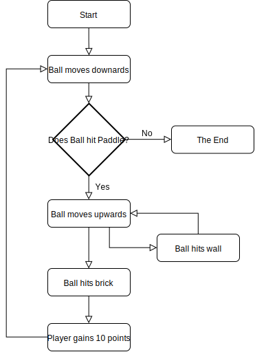
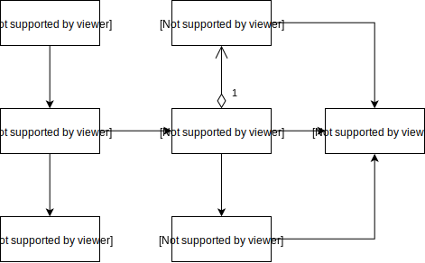

# BreakoutGame - Linguagens de Programação 2

Projeto realizado por:

* [Diana Nóia](https://github.com/DianaNoia): a21703004
* [Inês Gonçalves](https://github.com/ineesgoncalvees): a21702076

### Repositório

O projeto pode ser encontrado neste
[repositório](https://github.com/ineesgoncalvees/BreakoutGame).

## Repartição de Tarefas

* Diana Nóia
  * UML
  * Relatório
  * Programação:
    * Classe Program
    * Classe Menu:
      * Criar menu inicial;
      * Arranjar menu;
      * Adicionar cor aos bricks, ajustá-los ao ecrã;
    * Classe Paddle:
      * Adicionar a paddle;
    * Classe Breakout:
      * Adicionar game over;
    * Classe GameManager:
      * Adicionar Game Loop inicial;

* Inês Gonçalves
  * Programação:
    * Classe Program
    * Classe Brick
      * Adicionar informação para criar os bricks;
    * Classe Menu
      * Imprimir os bricks
      * Imprimir a paddle
    * Classe Paddle
      * Adicionar movimento da paddle
    * Classe Ball:
      * Criar bola;
      * Adicionar movimento da bola;
      * Adicionar colisões da bola com as paredes;
      * Adicionar colisões da bola com a paddle;
      * Adicionar colisões da bola com os bricks;
      * Criar sistema de pontos, onde se adicionam os pontos após a colisão com
  os  bricks
    * Classe Breakout
    * Classe GameManager

## Descrição do problema

O desafio para este projeto era implementar um jogo em C#, usando design
patterns principais na criação de jogos, bem como tendo em conta os diferentes
principios de design de classes, como por exemplo os principios SOLID.

A nossa escolha foi implementar o Breakout.

## Arquitetura da solução

O jogo foi organizado da seguinte forma: foi criada uma classe `Menu`, na qual
o jogo é desenhado. Esta classe chama as classes `Brick`, onde são passados os
valores para criar os *bricks*; A classe `Paddle`, onde são passados os valores
da *paddle* e onde a mesma é criada; E a classe `Ball`, na qual são passados os
valores da bola. e esta também é aqui instânciada. Foram criadas também uma
classe `Breakout`, na qual instanciamos o *Game Over* e uma classe `GameManager`
Onde temos o `GameLoop` e as medidas da janela.

Foi utilizado o `GameLoop` *patern*. Este corre com o uso de *threads* e
enquanto o jogador não perder. Todos as variáveis são iniciadas no `Start()` que
é chamado no principio do `GameLoop`. O programa em si é chamado no método
`Update()`.

Utilizámos o principio da Single Responsability Principle, onde uma classe deve
ter apenas uma responsabilidade.

O seguinte fluxograma demonstra como o programa funciona de forma simplicada.

O seguinte UML de classes simples que descreve a estrutura das classes.

;

Nota: Quando a bola colide com os *bricks* e apaga múltiplos é porque houve uma
colisão com eles todos, mesmo que tenha colidido só com um canto.

## Referências

Agradecemos aos nossos colegas Flávio Santos e Leandro Brás que nos auxiliaram
com a lógica do programa.

* Whitaker, R. B. (2016). The C# Player's Guide (3rd Edition). Starbound
  Software
  